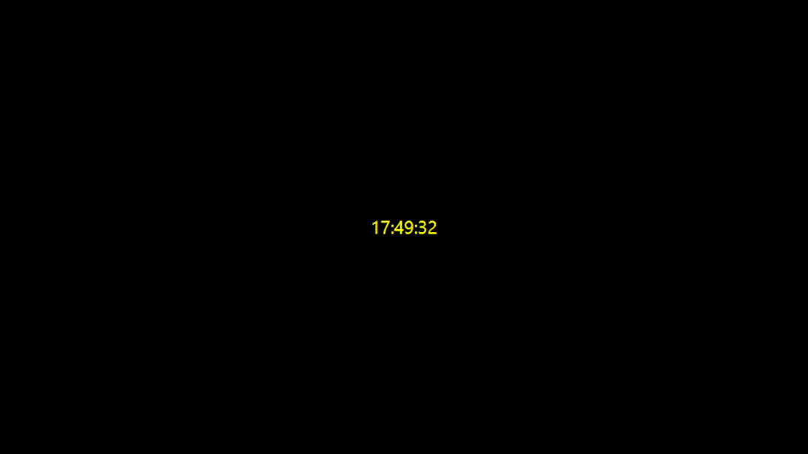

# Relogio Digital com JavaFX

Aplicacao desktop simples que exibe um relogio digital em tempo real.



## Repositorio

[relogio-digital](https://github.com/p-rcorreia/relogio-digital.git)

## Objetivo

Criar uma interface grafica com JavaFX que mostra a hora atual e atualiza os segundos continuamente.

## Conceitos praticados

- JavaFX
- `LocalDateTime`
- `DateTimeFormatter`
- `Timeline`
- `KeyFrame`
- `Duration` do JavaFX
- Atualizacao continua de interface
- Estilizacao simples com CSS inline

## Funcionalidades

- Exibe a hora atual no formato `HH:mm:ss`
- Atualiza a exibicao a cada segundo
- Usa fundo preto e texto amarelo
- Mantem a atualizacao enquanto a janela esta aberta

## Status

Concluido.

## Como funciona

O relogio usa `LocalDateTime.now()` para obter a hora atual e `DateTimeFormatter` para formatar o texto no padrao `HH:mm:ss`.

A atualizacao continua e feita com uma `Timeline` do JavaFX. Um `KeyFrame` atualiza o texto do rotulo e outro define o intervalo de um segundo.

## Como executar

No PowerShell, com a variavel `PATH_TO_FX` apontando para a pasta `lib` do JavaFX:

```powershell
javac --module-path "$env:PATH_TO_FX" --add-modules javafx.controls RelogioDigital.java
java --module-path "$env:PATH_TO_FX" --add-modules javafx.controls RelogioDigital
```

## Arquivo principal

```txt
RelogioDigital.java
```
